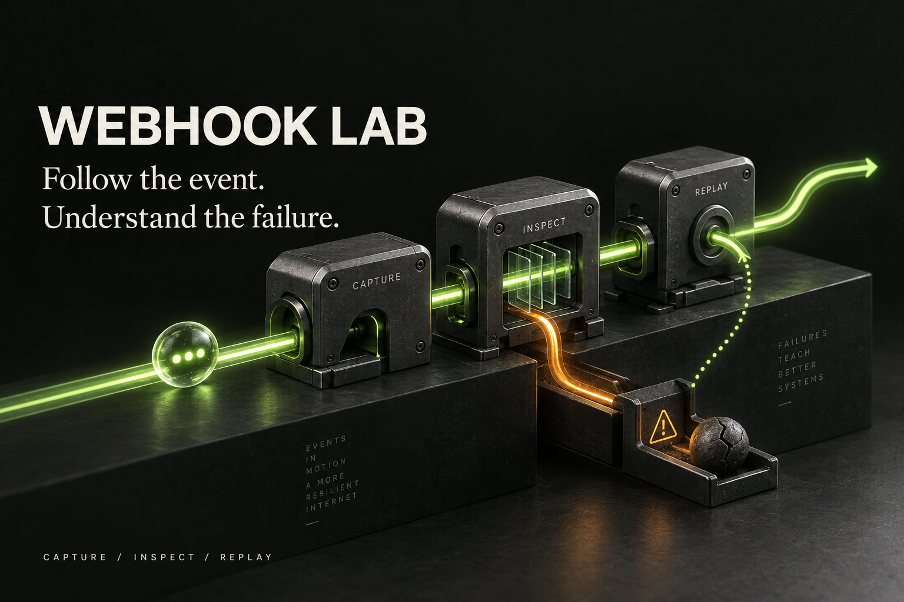

# Webhook Lab



## Probalo online

**[Abrir la demo interactiva →](https://diegogutierrez.pages.dev/webhook-lab/)** — sin instalar nada ni crear una cuenta.

Explorá eventos ficticios y simulá la recuperación 503 → 200, timeouts, inspección de payloads e historial de intentos. La demo está alojada en Cloudflare Pages y funciona en tu navegador: no recibe webhooks externos ni se conecta a la computadora del autor. Al recargar, vuelve a los ejemplos iniciales. [Alcance y despliegue](docs/public-demo.md).

El backend Python/FastAPI que se explica debajo es la aplicación local completa. Las direcciones `127.0.0.1` identifican tu propia computadora si decidís instalarla; no son el enlace de la demo pública.

[](https://github.com/DimaGutierrez/webhook-lab/actions/workflows/ci.yml)

[English](README.md) · [Wiki y guías](https://github.com/DimaGutierrez/webhook-lab/wiki) · [Discussions](https://github.com/DimaGutierrez/webhook-lab/discussions)

**Seguí el evento. Entendé el fallo.**

Un laboratorio local de webhooks construido con Python y FastAPI. Recibí un evento, inspeccioná su contenido y conservá el historial de cada reproducción.

Estado: prototipo funcional v0.1 para un usuario. Una bandeja de entrada, persistencia SQLite y reproducción manual. Sin servicio público ni cola de reintentos automáticos.

## Participá en el proyecto

- [Probá el desafío 503 → 200](https://github.com/DimaGutierrez/webhook-lab/discussions/1) y contá qué paso te resultó confuso.
- [Compartí cómo evitás webhooks duplicados](https://github.com/DimaGutierrez/webhook-lab/discussions/2).
- [Elegí la próxima función](https://github.com/DimaGutierrez/webhook-lab/discussions/3) y explicá qué problema te resolvería.

Podés comentar en español o inglés. Si te sirve, guardalo con una estrella y compartí un caso de uso reproducible.

## Ejecutar el backend completo localmente

Necesitás Python 3.12 o superior. Desde la raíz del proyecto:

```powershell
python -m venv .venv
.\.venv\Scripts\python.exe -m pip install -r requirements.lock
.\.venv\Scripts\python.exe -m webhook_lab
```

En macOS/Linux, usá `.venv/bin/python` en lugar de `.\.venv\Scripts\python.exe`.

1. Abrí http://127.0.0.1:8000.
2. Copiá el token de `data/admin.token` al formulario.
3. Pulsá **Send sample event**.
4. Elegí **Demo · unavailable (503)** y pulsá **Replay**.
5. Elegí **Demo · accepts (200)** y repetí. El historial conserva ambos intentos.

Los destinos Demo son simulados dentro del proceso. Para probar conexiones HTTP reales, levantá `examples/receiver.py` y configurá un destino como explica el [README principal](README.md#replay-to-your-own-service).

## Qué demuestra

- Diseño de una API y separación entre recepción, persistencia y entrega.
- Conservación exacta de los bytes del evento.
- Autenticación del panel y ocultamiento de valores de encabezados no permitidos.
- Registro de respuestas HTTP, fallos y tiempos por intento.
- Pruebas de errores de red, límites y captura concurrente.

El cuerpo del evento se guarda sin ocultar datos. Usá eventos ficticios para demostraciones. El límite es de 256 KiB por evento y 5.000 eventos; no hay borrado automático. Los reintentos son manuales y no existe garantía de entrega exactamente una vez.

[Arquitectura](docs/architecture.md) · [Próximas versiones](docs/roadmap.md) · [Seguridad](SECURITY.md)
