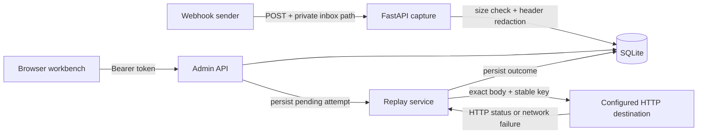

# Architecture and decisions

## Request lifecycle

## Decisions

1. **SQLite for the first local version.** No separate service is necessary to reproduce the demo. WAL improves reader/writer coexistence. Event capacity checks and inserts run in one `BEGIN IMMEDIATE` transaction. Small synchronous database operations still block the API loop; measure before increasing workload. This is not a production throughput claim.
2. **One app process.** Startup marks unfinished attempts `interrupted`. Multiple app processes would misclassify each other's live attempts. A future worker needs leases and ownership before multi-process operation is supported.
3. **Persist before acknowledging.** Capture returns `201` after the insert commits. An accepted event survives an app restart. Database backups and durable infrastructure are the operator's responsibility.
4. **Explicit attempts.** Manual replay writes `pending` before sending, then records `delivered` or `failed`. On interruption, remote side effects may already have happened; retrying can duplicate work. No exactly-once guarantee is implied.
5. **Named destinations.** API callers select a server-configured name. They cannot supply arbitrary URLs. Redirects and environment proxies are disabled. The target configuration and its DNS are trusted operator inputs, not untrusted public user inputs.
6. **Diagnostic replay.** Body bytes and content type survive. Authentication, cookies and provider signatures do not. A stable event ID becomes the replay idempotency key, but only a cooperating receiver can enforce idempotency.
7. **Honest demo.** Built-in success/failure handlers use an in-process ASGI transport. Their timings are not internet latency measurements. The included external receiver exercises real network delivery.
8. **No frontend framework.** A small static UI keeps packaging simple and the project focused on backend behavior. Payloads and headers are displayed with `textContent`, never executed as HTML. Refresh is manual.

## Modules

| Module | Responsibility |
|---|---|
| `config.py` | Environment and destination validation |
| `store.py` | Schema, event persistence, attempt lifecycle, capacity |
| `replay.py` | One bounded outgoing HTTP attempt |
| `app.py` | HTTP routes, auth, request limits, lifecycle |
| `static/` | Inspector UI |

## Failure semantics

| Condition | Behavior |
|---|---|
| Wrong inbox token | `404` |
| Missing or invalid admin token | `401` |
| Body over 256 KiB | `413`, not inserted |
| Event capacity reached | `507`, not inserted |
| Unknown target | `422`, no replay attempt created |
| Destination 2xx | Attempt `delivered` |
| Destination 3xx/4xx/5xx | Attempt `failed`; redirects not followed |
| Timeout/connection failure | Attempt `failed`; sanitized error |
| Process crash or cancelled request | May have reached destination; recorded as interrupted |

## Next architectural step

Introduce schema migrations, then PostgreSQL and a durable job table with claimed leases. Keep manual replay distinct from a retry policy. Only add Redis if a measured need justifies a second infrastructure dependency. Test worker restart, duplicate delivery, and receiver idempotency before claiming reliable background delivery.
